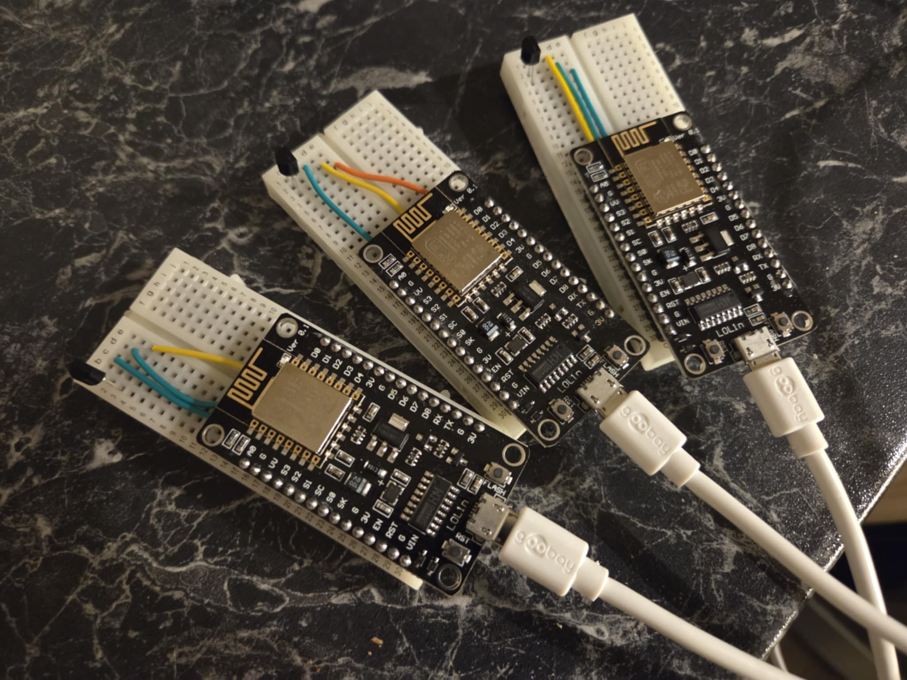
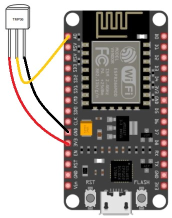
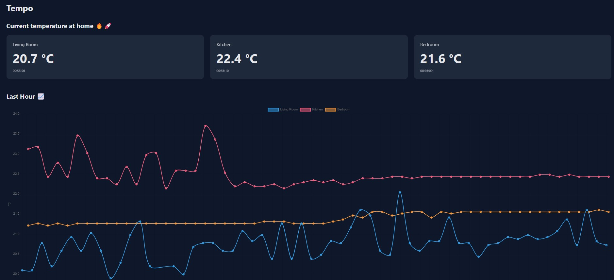

# Tempo
## Overview
This is a small home project where I have built "thermometers" to put around the house. The thermometers post readings for storage in a cloud backend. There is a frontend webpage where I can see the current temperature and a graph showing temperature variations over time.

## Hardware
The thermometers are built using
* ESP8266
* TMP36 TO-92 temperature sensor
* GPIO cables
* Breadboard
* 5W USB power supply

### Pin connections

The TMP36 has +Vs, Vout and GND pins. I have connected them to the ESP8266 3.3V, A0 and GND respectively.

## Firmware

The ESP8266 is built using PlatformIO in VS Code. See the firmware/ directory.

## Backend
The backend runs on CloudFlare as a simple .js worker. See the backend/ directory. It has a small API with the following endpoints:

| Type | Endpoint | Description |
|-|-|-|
|POST| /v1/temperature | Post a new reading |
|GET| /v1/devices/current | Get the current temperatures |
|GET| /v1/devices/history | Get time series of temperature |

## Frontend
The frontend is simple HTML/CSS + JavaScript. It shows current temperature and temperature over time.

